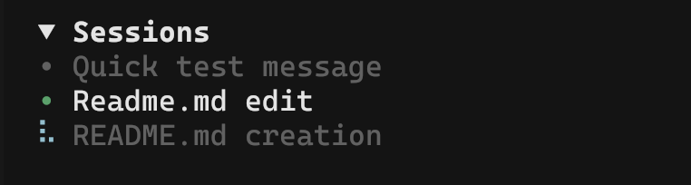

[English](./README.md) | 简体中文

# opencode-sessions-sidebar



OpenCode TUI 插件，在侧边栏显示当前项目的活跃会话列表。

## 功能特性

- **会话列表**：显示当前项目最近更新的最多 10 个会话（可配置）
- **点击切换**：点击列表中的任意会话即可立即跳转
- **当前会话标记**：活跃会话以 `•` 圆点标识，使用主题 success 色（与 MCP 已连接状态一致）
- **运行中指示器**：正在生成的会话显示盲文旋转动画
- **项目作用域**：仅显示属于当前项目目录的会话
- **实时更新**：列表在 `session.created` / `session.updated` / `session.deleted` 事件触发时自动刷新
- **可折叠面板**：点击标题栏可折叠/展开；状态在重启后保持
- **斜杠命令**：`/sessions-refresh` 和 `/sessions-count` 用于运行时配置
- **原生外观**：无框线面板，样式与内置 MCP / Context 侧栏块一致，直接使用主题颜色；会话标题按单词换行

## 安装

### 方式一：OpenCode 命令面板（推荐）

在 OpenCode 中按 `Ctrl + P`，搜索 `install plugin`，然后输入：

```
opencode-sessions-sidebar@latest
```

### 方式二：手动安装

```bash
npm install -g opencode-sessions-sidebar@latest
```

然后创建或编辑 `~/.config/opencode/tui.jsonc`：

```jsonc
{
  "$schema": "https://opencode.ai/tui.json",
  "plugin": ["opencode-sessions-sidebar@latest"]
}
```

### 重启 OpenCode

进入任意会话，侧边栏即会出现 Sessions 面板。

## 斜杠命令

| 命令 | 说明 |
|---------|-------------|
| `/sessions-refresh` | 手动刷新会话列表 |
| `/sessions-count` | 设置显示的最大会话数量（1-100） |

## 许可证

MIT
